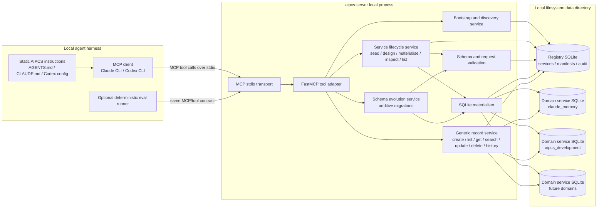
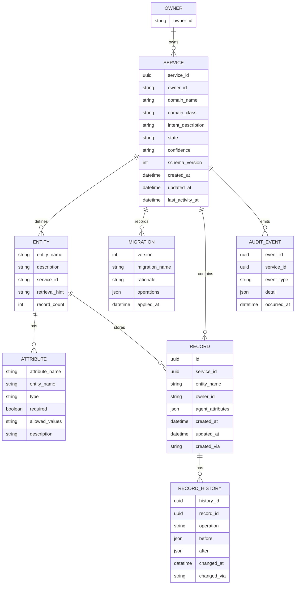
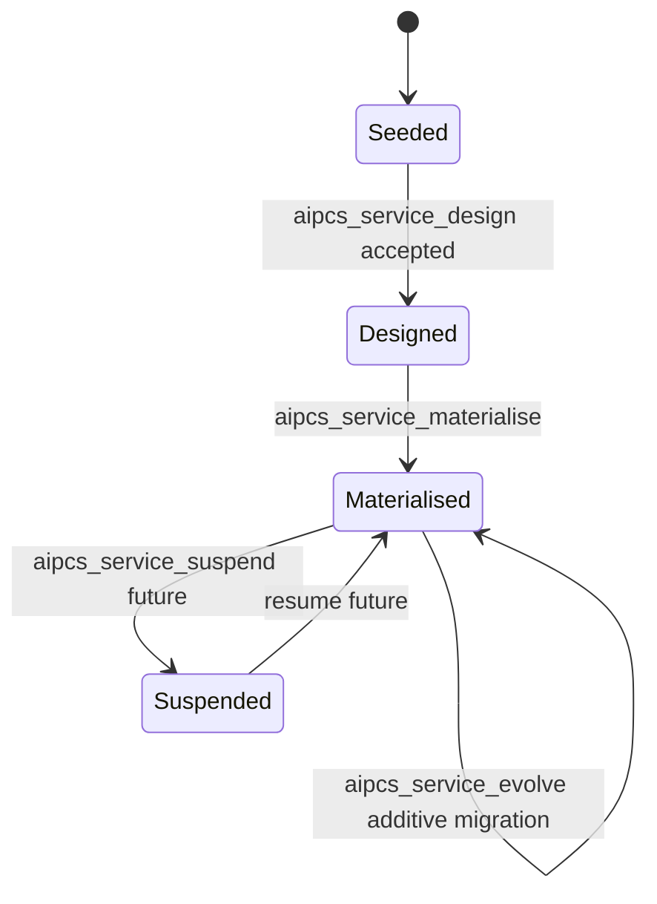
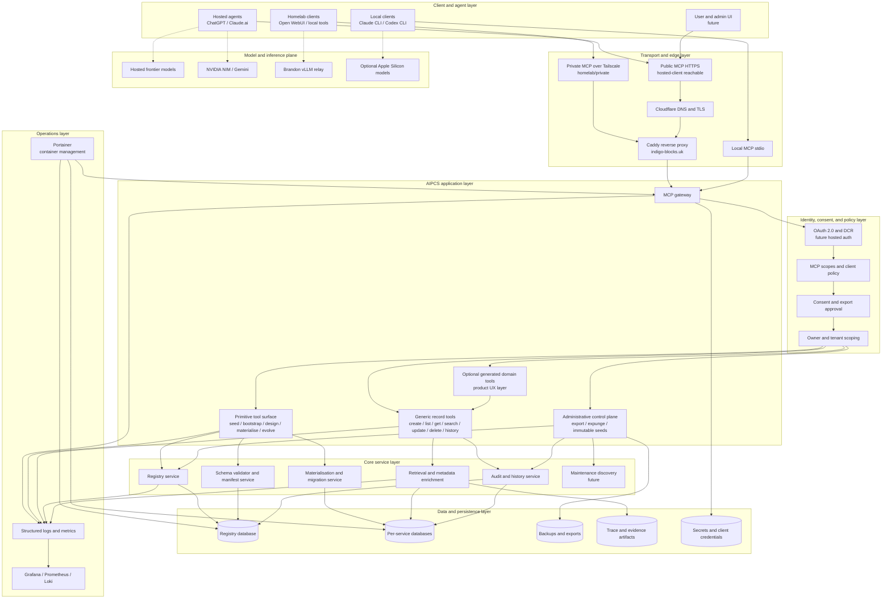

# AIPCS Architecture Diagrams

This document captures three views of AIPCS:

1. The current local-only MCP reference implementation.
2. The current conceptual data model.
3. The exploded target productised infrastructure.

The diagrams distinguish the paper-minimum research surface from later productisation layers. The local implementation is enough to test the core claim: the agent owns, uses, and evolves its memory architecture through tool-mediated primitives.

---

## Local-Only MCP Service

### Local-Only Definitions

| Component | Definition |
|---|---|
| Static AIPCS instructions | Thin harness guidance that tells the agent AIPCS may exist, to call bootstrap, to retrieve bounded records, and to persist/evolve useful memory. |
| MCP stdio transport | The current local connection path. No public network service or hosted-client auth is required. |
| FastMCP tool adapter | The MCP-facing layer that exposes stable primitive tools to the agent. |
| Bootstrap and discovery service | Returns a shape-only data-dictionary map of services, entities, schemas, counts, and hints. It is orientation, not recall. |
| Service lifecycle service | Owns `seed`, `design`, `materialise`, `inspect`, and `list`. |
| Generic record service | Operates domain records through schema-aware generic tools. This is the current proof surface instead of generated domain-specific tools. |
| Schema evolution service | Applies additive schema evolution: add entity, add optional attribute, add enum value, update entity description, update service intent. |
| Registry SQLite | Server-owned metadata store for services, manifests, lifecycle state, migrations, and audit. |
| Domain service SQLite | One SQLite database per materialised service. The agent never writes these directly as part of the contract. |

### Local Boundary

The local agent may physically see repository and data files during development, but direct SQLite edits are out-of-contract. Normal behavior must go through MCP tools so validation, server-controlled fields, history, and audit remain meaningful.

---

## Data Model

### Data Model Definitions

| Term | Definition |
|---|---|
| Owner | The user or account scope for records and services. The current local prototype assumes single-user local operation but keeps `owner_id` as a scoping primitive. |
| Service | A seeded or materialised persistent context service for one domain, such as `claude_memory` or `aipcs_development`. |
| Domain class | A broad, non-binding top-level anchor such as `project`, `career`, or `memory`. It supports discovery and interoperability but is not a closed taxonomy. |
| Intent description | The seed-level explanation of what the service is meant to track. Bootstrap should expose this so agents know where to probe. |
| Entity | A schema-defined record type inside a service, such as `decision`, `feedback_memory`, or `reference_memory`. |
| Attribute | A schema-defined field on an entity. Constrained fields create retrieval pressure; open-text fields are allowed but should be self-audited for prose leakage. |
| Record | A persisted domain object. Server fields are controlled by AIPCS; agent-defined fields come from the entity schema. |
| Record history | Append-style mutation history for creates, updates, and deletes where available. This preserves repair/evolution context. |
| Migration | Schema evolution history. It records what changed, why, and which operations were applied. |
| Audit event | Server/system event log. Productised administrative controls should use audit/history rather than silently altering memory. |

### Lifecycle State

### Server-Controlled Versus Agent-Owned Fields

| Server-controlled | Agent-owned through schema |
|---|---|
| `id`, `owner_id`, `created_at`, `updated_at`, `created_via`, mutation history, lifecycle timestamps | Entity names, attribute names, optional provenance fields, status fields, record payload values, service intent refinements |

The server enforces the tool contract. The agent owns the memory architecture within that contract.

---

## Exploded Productised Infrastructure

### Productised Layer Definitions

| Layer | Purpose | Current status |
|---|---|---|
| Client and agent layer | Places where agents or users initiate work. Includes local CLIs, hosted clients, Open WebUI, and future admin UI. | Local CLI proven; hosted and admin UI future. |
| Transport and edge layer | Moves from local `stdio` to private homelab and public hosted-client reachability. | Local `stdio` proven; homelab substrate exists; public MCP future. |
| Identity, consent, and policy layer | OAuth/DCR, MCP scopes, user consent, owner/tenant scoping, and export approvals. | Designed, deferred from first paper proof. |
| AIPCS application layer | The externally visible tool/API surface. Stable primitives remain core; generated domain tools are optional product UX. | Primitive and generic record tools implemented locally. |
| Core service layer | Internal services that validate, materialise, retrieve, enrich, audit, and maintain memory. | Partially implemented in `aipcs-server`. |
| Data and persistence layer | Registry, per-service stores, backups, trace/evidence artifacts, and secrets. | Local SQLite implemented; production stores/backups/secrets future. |
| Operations layer | QNAP/homelab hosting, container management, logs, metrics, dashboards. | Homelab available as deployment substrate; not needed for paper-minimum proof. |
| Model and inference plane | The model providers used by clients. AIPCS hosts memory services, not heavy inference. | External to AIPCS; can include hosted models, NVIDIA/Gemini, vLLM, or local Apple Silicon. |

### Productisation Boundaries

- The paper-minimum proof is local Python/SQLite/MCP plus deterministic and live-agent evidence.
- Homelab deployment is the preferred durable service substrate once the local semantics are stable, but it should not distort the research claim.
- Hosted ChatGPT/Claude-style clients require public MCP or a bridge because provider infrastructure initiates the connection.
- Administrative controls such as expunge, immutable external seeds, and compliance export belong to a separate control plane. They should not silently rewrite the normal agent memory plane.
- Direct database access is never a supported agent path in productised deployments.
